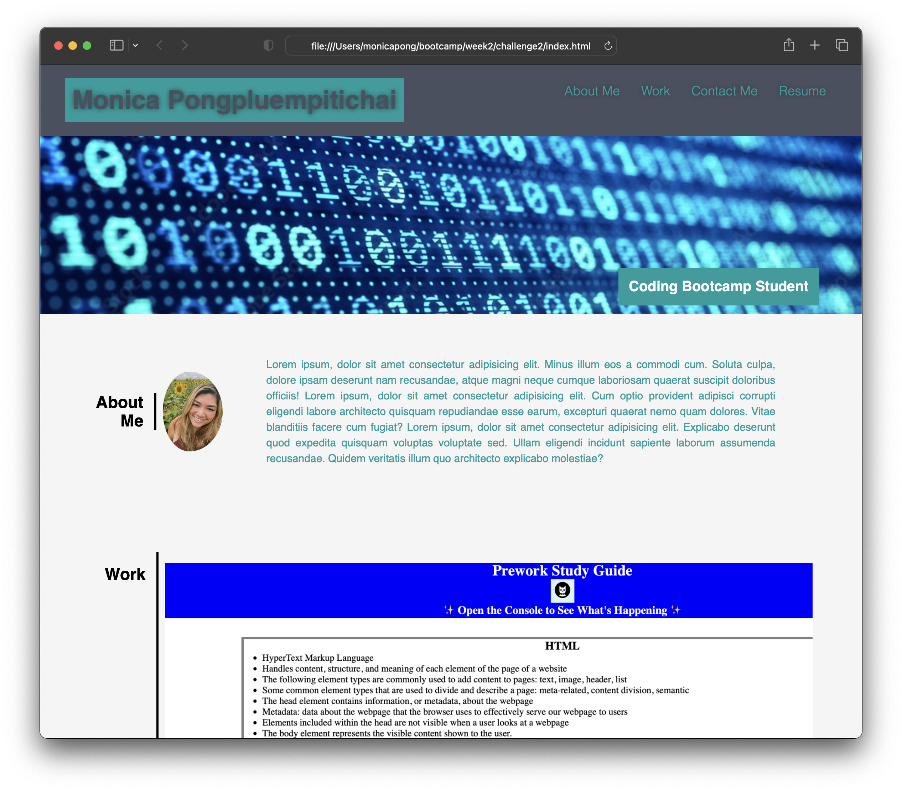
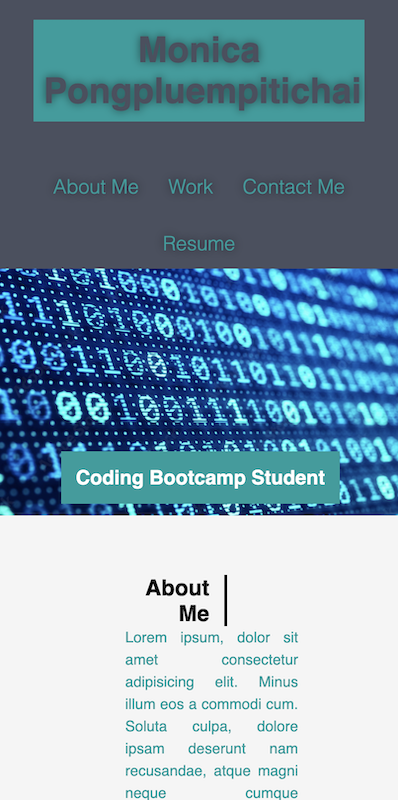

# Module 2 Advanced CSS Challenge: Professional Portfolio

## Description

This is a sample of a professional portfolio built using HTML and CSS. My motivation behind building this project is to continuley add to it over time to become my personal portfolio of work in order to be a stronger candidate when applying to the work force.

## Usage

Use the top right navigation panel to visit the different sections of the webpage. Select the "Resume" link to be taken to a pdf of the resume. 

Under the work section, hover over the title of the project and click on it to be lead to the deployed live site of the project. 

Contact information can be found under the Contact Me section. Clicking on the phone number, email address, LinkedIn, or Github links will bring up each respective action. 

The webpage is responsive to screen size and will change to fit the screen of a tablet or phone. 

### Desktop Screen

### Mobile Screen

Link to deployed webpage: https://monicapong.github.io/challenge2/

## License

Please refer to the GitHub Repository for licensing information.
Link to GitHub repository: https://github.com/monicapong/challenge2

